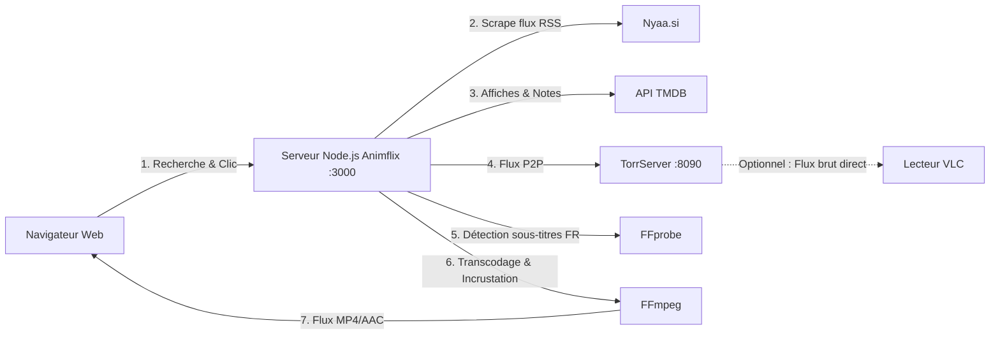

# 🍿 Animflix (ServeurAnimeTorr)

Application web de streaming d'animes en direct à partir de torrents (Nyaa), avec jaquettes automatiques (TMDB), détection intelligente des sous-titres français (FFprobe) et transcodage à la volée (FFmpeg).

---

## 📋 Sommaire
1. [Fonctionnalités](#-fonctionnalités)
2. [Comment ça marche ?](#-comment-ça-marche-)
3. [Prérequis](#-prérequis)
4. [Installation & Configuration](#-installation--configuration)
5. [Lancement de l'application](#-lancement-de-lapplication)
6. [Guide d'utilisation](#-guide-dutilisation)
7. [Dépannage & Astuces](#-dépannage--astuces)

---

## ✨ Fonctionnalités

- **Recherche intégrée sur Nyaa.si** avec filtres : VOSTFR, VF, Multi-Sub, VOSTA.
- **Récupération automatique des jaquettes et notes** via l'API TheMovieDatabase (TMDB).
- **Streaming instantané sans téléchargement complet** grâce à TorrServer.
- **Incrustation automatique des sous-titres français** analysés par FFprobe et incrustés en direct par FFmpeg.
- **Option de lecture externe (VLC)** : bouton en 1 clic pour copier le flux direct sans passer par le transcodeur.

---

## ⚙️ Comment ça marche ?



1. **TorrServer** (`:8090`) télécharge les morceaux de vidéo du torrent dans la mémoire tampon au fur et à mesure de la lecture.
2. **Animflix** (`:3000`) fournit l'interface utilisateur, interroge Nyaa et TMDB.
3. Lors du clic sur une vidéo, **FFprobe** inspecte les pistes de sous-titres pour sélectionner la piste française (`fre`/`fra`).
4. **FFmpeg** convertit le flux audio en AAC, incruste les sous-titres et sert le flux MP4 directement dans le navigateur.
5. Si votre processeur peine à transcoder ou si vous préférez un lecteur externe, un lien brut vers **TorrServer** peut être ouvert dans **VLC**.

---

## 📦 Prérequis

Avant de lancer l'application, assurez-vous d'avoir installé sur votre machine :

- **Node.js** (v18 ou supérieure recommandée) et **npm**.
- **FFmpeg & FFprobe** :
  ```bash
  sudo apt update
  sudo apt install ffmpeg
  ```
  *(Vérifiez avec `ffmpeg -version` et `ffprobe -version`)*

---

## 🔧 Installation & Configuration

### 1. Installer les dépendances Node.js

Dans le répertoire du projet, lancez :
```bash
npm install
```

### 2. Vérifier l'adresse IP et la configuration

Ouvrez le fichier [animflix.js](file:///home/barriols/Documents/ServeurAnimeTorr/animflix.js) :

- **`TORRSERVER_IP`** :
  - Par défaut : `"192.168.1.55"` (ou `localhost` si vous l'utilisez uniquement sur la même machine).
  - Si votre adresse IP locale a changé (ex: avec `ip a`), mettez-la à jour pour pouvoir y accéder depuis d'autres appareils du réseau local (PC, smartphone, TV).
- **`TMDB_API_KEY`** : clé API TMDB pour afficher les jaquettes.

### 3. Donner les droits d'exécution à TorrServer

Assurez-vous que le binaire TorrServer est exécutable :
```bash
chmod +x TorrServer-linux-amd64
```

---

## 🚀 Lancement de l'application

Le projet nécessite **deux processus actifs en parallèle** : TorrServer et le serveur Node.js.

### Étape 1 : Démarrer TorrServer

Dans un premier terminal :
```bash
./TorrServer-linux-amd64
```
> TorrServer s'exécute en arrière-plan et écoute sur le port **8090**.  
> Vous pouvez tester son interface d'administration à l'adresse : [http://localhost:8090](http://localhost:8090) (ou `http://192.168.1.55:8090`).

### Étape 2 : Démarrer le serveur Animflix

Dans un second terminal :
```bash
npm start
# ou directement : node animflix.js
```
> Le serveur web est prêt et écoute sur le port **3000**.

*(Note : `node server.js` est une version alternative plus légère sans les jaquettes TMDB).*

---

## 🖥️ Guide d'utilisation

1. Ouvrez votre navigateur et rendez-vous sur :
   - En local : [http://localhost:3000](http://localhost:3000)
   - Sur votre réseau local : `http://192.168.1.55:3000` (remplacez par votre IP).
2. Entrez le nom d'un anime dans la barre de recherche (ex: *Frieren*, *Jujutsu Kaisen*, *One Piece*).
3. Sélectionnez la langue voulue : **VOSTFR**, **VF**, **Multi-Sub** ou **VOSTA**.
4. Cliquez sur **Chercher** : les jaquettes, titres, tailles et nombre de seeders apparaissent.
5. Cliquez sur la carte de l'épisode souhaité :
   - Un écran de chargement apparaît pendant que TorrServer se connecte aux pairs et que FFprobe analyse les flux de sous-titres (cela prend généralement 10 à 30 secondes).
   - Le lecteur vidéo se lance automatiquement dès que le flux est prêt.
6. **Regarder dans VLC (Alternative recommandée si ça saccade)** :
   - Lors du chargement ou sous le lecteur, cliquez sur **🟠 Copier le lien brut pour VLC**.
   - Ouvrez **VLC**.
   - Allez dans le menu **Média > Ouvrir un flux réseau...** (ou `Ctrl + N`).
   - Collez le lien (`Ctrl + V`) et faites **Lire**.
   - Dans VLC, vous pouvez changer la piste audio et la piste de sous-titres librement sans aucune charge processeur sur le serveur !

---

## ❓ Dépannage & Astuces

- **Le chargement reste bloqué / "Erreur lors du chargement"** :
  - Vérifiez le nombre de **seeders** du torrent. Moins de 5 seeders peut ralentir considérablement le démarrage du flux.
  - Vérifiez que **TorrServer** (`./TorrServer-linux-amd64`) tourne bien dans son terminal.
- **La vidéo saccade dans le navigateur** :
  - L'incrustation des sous-titres par FFmpeg demande de la puissance processeur. Privilégiez la lecture via **VLC** grâce au bouton de copie du lien réseau.
- **Accès depuis une TV / Smartphone** :
  - Connectez l'appareil au même réseau Wi-Fi que le serveur et saisissez l'adresse `http://<IP_DU_SERVEUR>:3000`.