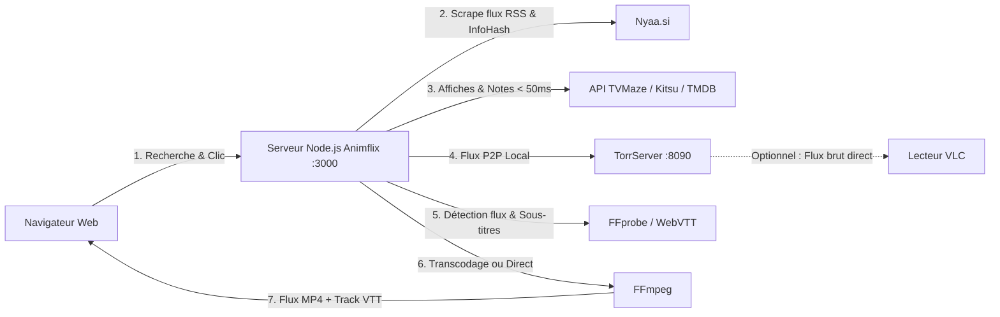

# 🍿 Animflix (ServeurAnimeTorr)

Application web de streaming d'animes en direct à partir de torrents (Nyaa), avec jaquettes et notes instantanées (TVMaze / Kitsu / TMDB), détection intelligente des flux audio/sous-titres français (FFprobe), sous-titres WebVTT personnalisables (0% CPU) et transcodage à la volée (FFmpeg).

---

## 📋 Sommaire
1. [Fonctionnalités & Optimisations](#-fonctionnalités--optimisations)
2. [Comment ça marche ?](#-comment-ça-marche-)
3. [Prérequis](#-prérequis)
4. [Installation & Configuration](#-installation--configuration)
5. [Lancement de l'application](#-lancement-de-lapplication)
6. [Guide d'utilisation](#-guide-dutilisation)
7. [Dépannage & Astuces](#-dépannage--astuces)

---

## ✨ Fonctionnalités & Optimisations

- **Recherche ultra-rapide sur Nyaa.si (< 400 ms)** avec filtres : VOSTFR, VF, Multi-Sub, VOSTA.
- **Génération directe de liens Magnets P2P** : extraction de l'infoHash BitTorrent et génération de liens `magnet:?xt=urn:btih:...` avec trackers publics (évite les blocages Cloudflare/anti-bot sur les fichiers `.torrent`).
- **Récupération intelligente des jaquettes et notes d'animes** :
  - Moteur prioritaire **TVMaze API** (100% gratuit, sans clé requise, ultra-rapide < 50 ms).
  - Fallback automatique vers **Kitsu API** (spécialisée anime) et compatibilité **TMDB**.
  - Déduplication ciblée sur la franchise et algorithme de nettoyage des titres pour un matching à 95%+.
- **Système de cache mémoire haute performance** :
  - Cache des métadonnées (affiches & notes) conservé 24h.
  - Cache des recherches (5 min) : résultats quasi-instantanés (< 20 ms).
- **Deux modes de lecture au choix** :
  - ⚡ **Lecture Directe (0% CPU, ultra-rapide)** : copie brute du flux vidéo MP4 avec extraction et streaming en direct des pistes de sous-titres WebVTT (`<track>`).
  - 🎨 **Incrustation des sous-titres FR (Transcodage)** : FFprobe analyse les flux en 1-2s (`-probesize 4M`), FFmpeg transcode en multithread (`-threads 0`, zéro latence) et incruste les sous-titres français.
- **Personnalisation complète du style des sous-titres** :
  - Menu dédié accessible via le bouton `🎨 Style` ou la touche <kbd>S</kbd>.
  - **Disposition intelligente** : fusionne automatiquement les phrases courtes coupées artificiellement sur 2 lignes pour un affichage sur **1 seule ligne** nette, tout en préservant les répliques de dialogue (`- `) et les paroles musicales (`♪`).
  - Réglage de la **taille** (Petite, Normale, Grande, Très grande), de la **couleur** (Blanc, Jaune Anime VOSTFR, Cyan, Vert, Rose), de l'**arrière-plan** (transparent, semi-transparent, opaque), des **contours / ombres** (outline 360°, ombre marquée, etc.) et de la **police**.
  - Aperçu en direct et mémorisation automatique de vos préférences dans le navigateur (`localStorage`).
- **Option de lecture externe (VLC)** : bouton de copie d'URL réseau universelle (détecte dynamiquement l'hôte).
- **Lecteur web enrichi** : raccourcis clavier (<kbd>Espace</kbd> Pause, <kbd>C</kbd> Sous-titres, <kbd>S</kbd> Menu Style, <kbd>F</kbd> Plein écran, <kbd>Échap</kbd> Quitter, <kbd>←</kbd> / <kbd>→</kbd> -5s / +5s).
- **Cache TorrServer augmenté à 200 Mo** pour supprimer les interruptions de flux sur les animes 1080p à haut débit.

---

## ⚙️ Comment ça marche ?



---

## 📦 Prérequis

- **Node.js** (v18 ou supérieure) et **npm**.
- **FFmpeg & FFprobe** :
  ```bash
  sudo apt update
  sudo apt install ffmpeg
  ```

---

## 🔧 Installation & Configuration

### 1. Installer les dépendances Node.js

Dans le répertoire du projet :
```bash
npm install
```

### 2. Droits d'exécution de TorrServer

```bash
chmod +x TorrServer-linux-amd64
```

---

## 🚀 Lancement de l'application

### Option A : Gestion recommandée avec PM2 (Production & Arrière-plan)

**PM2** est un gestionnaire de processus professionnel pour Linux. Il permet de faire tourner **Animflix** et **TorrServer** en tâche de fond 24h/24, de les redémarrer automatiquement en cas d'erreur inattendue et de les relancer automatiquement au démarrage de votre PC ou serveur.

#### 1. Installer PM2 globalement
Si PM2 n'est pas encore installé sur votre système :
```bash
sudo npm install -g pm2
```

#### 2. Démarrage initial des services
Vous pouvez lancer les deux services en une seule commande grâce au fichier de configuration `ecosystem.config.cjs` inclus :
```bash
pm2 start ecosystem.config.cjs
```

*(Alternative manuelle sans fichier de configuration)* :
```bash
# 1. Démarrer le moteur de streaming TorrServer
pm2 start ./TorrServer-linux-amd64 --name torrserver

# 2. Démarrer le serveur web Animflix
pm2 start animflix.js --name animflix
```

#### 3. Sauvegarder et activer le lancement automatique au démarrage (Boot)
Pour que l'application et TorrServer redémarrent automatiquement même après un redémarrage de la machine :
```bash
# 1. Sauvegarder la liste des processus actifs dans PM2
pm2 save

# 2. Configurer le service systemd au démarrage de l'OS
pm2 startup
```
> [!NOTE]
> La commande `pm2 startup` affiche une commande personnalisée avec `sudo env PATH=...`. Copiez et collez cette commande dans votre terminal pour finaliser la configuration systemd.

#### 4. Commandes utiles au quotidien

| Action | Commande |
|---|---|
| **Voir l'état des services** (CPU, RAM, Uptime) | `pm2 list` ou `pm2 status` |
| **Consulter les logs en direct** | `pm2 logs` *(ou `pm2 logs animflix --lines 50`)* |
| **Redémarrer tous les services** | `pm2 restart all` |
| **Redémarrer un service spécifique** | `pm2 restart animflix` ou `pm2 restart torrserver` |
| **Arrêter les services** | `pm2 stop all` |
| **Tableau de bord interactif** (ressources temps réel) | `pm2 monit` |

---

### Option B : Lancement manuel (Mode développement / Débogage sans PM2)

Si vous souhaitez simplement tester l'application dans votre terminal sans installer PM2, ouvrez **deux terminaux** distincts :

1. **Terminal 1 (Moteur TorrServer)** :
   ```bash
   ./TorrServer-linux-amd64
   ```
2. **Terminal 2 (Serveur Web Animflix)** :
   ```bash
   npm start
   # ou directement : node animflix.js
   ```

---

## 🖥️ Guide d'utilisation

1. Ouvrez votre navigateur sur :
   - En local : [http://localhost:3000](http://localhost:3000)
   - Sur votre réseau local : `http://<IP_SERVEUR>:3000` (ex: `192.168.1.55:3000`).
2. Entrez le nom d'un anime dans la barre de recherche (ex: *Frieren*, *Naruto*, *Dandadan*).
3. Choisissez la langue : **VOSTFR**, **VF**, **Multi-Sub** ou **VOSTA**.
4. Sélectionnez votre mode de streaming :
   - **⚡ Lecture Directe** : 0% CPU, démarrage instantané avec extraction des sous-titres WebVTT en direct.
   - **🔄 Transcodage H.264** : compatibilité standard si votre navigateur ne supporte pas le conteneur ou le codec d'origine.
5. Cliquez sur un épisode pour lancer la lecture :
   - **Sous-titres automatiques** : Les sous-titres français (VOSTFR) sont automatiquement extraits et affichés en direct dans le lecteur web.
   - **Bouton CC & Sélecteur** : Changez de piste audio/sous-titres ou masquez-les en un clic.
   - **Menu `🎨 Style`** : Personnalisez la taille, la couleur (jaune anime, blanc, etc.), l'arrière-plan, les contours d'ombre et la disposition (1 ligne max ou standard) avec aperçu en temps réel.
6. **Raccourcis clavier dans le lecteur** :
   - <kbd>Espace</kbd> : Lecture / Pause
   - <kbd>C</kbd> : Activer / Masquer les sous-titres (CC ON/OFF)
   - <kbd>S</kbd> : **Ouvrir / Fermer le menu de style des sous-titres**
   - <kbd>F</kbd> : Basculer en plein écran
   - <kbd>Échap</kbd> : Fermer le menu de style ou quitter le lecteur
   - <kbd>←</kbd> / <kbd>→</kbd> : Reculer / Avancer de 5 secondes
7. **Lecture VLC (Alternative)** :
   - Si vous préférez utiliser votre lecteur externe dédié (pour bénéficier des polices ou effets graphiques ASS exotiques), cliquez sur **🟠 Ouvrir dans VLC** (le lien réseau est automatiquement copié dans votre presse-papiers).
   - Dans VLC : `Média > Ouvrir un flux réseau (Ctrl+N)` et collez l'URL.

---

## ❓ Dépannage & Astuces

- **Le processeur chauffe ou la vidéo saccade ?**
  - Basculez le sélecteur sur **⚡ Lecture Directe** ou utilisez le lien **VLC**.
- **Pas de résultat / recherche lente ?**
  - Vérifiez la connexion Internet et les filtres Nyaa. Le cache garde vos recherches précédentes en mémoire pour un accès immédiat.
- **Accès depuis une TV / Smartphone** :
  - Connectez l'appareil au même réseau Wi-Fi que le serveur et ouvrez l'adresse IP locale du serveur sur le port 3000.