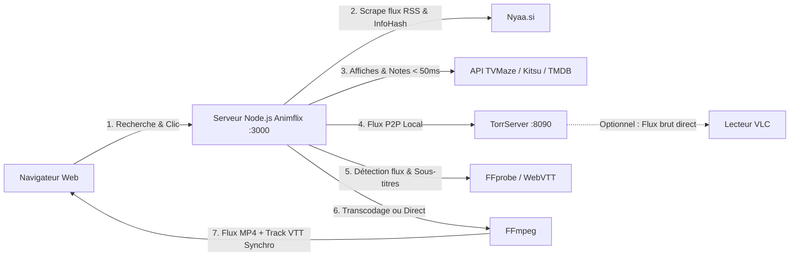

# 🍿 Animflix (ServeurAnimeTorr)

Application web de streaming d'animes en direct à partir de torrents (Nyaa), avec jaquettes et notes instantanées (TVMaze / Kitsu / TMDB), détection intelligente des flux audio/sous-titres français (FFprobe), lecteur multimédia sur-mesure, sous-titres WebVTT personnalisables (0% CPU), synchronisation précise au keyframe et transcodage à la volée (FFmpeg).

---

## 📋 Sommaire
1. [Fonctionnalités & Optimisations](#-fonctionnalités--optimisations)
2. [Comment ça marche ?](#-comment-ça-marche-)
3. [Architecture du Projet](#-architecture-du-projet)
4. [Prérequis](#-prérequis)
5. [Installation & Configuration](#-installation--configuration)
6. [Lancement de l'application](#-lancement-de-lapplication)
7. [Guide d'utilisation](#-guide-dutilisation)
8. [Raccourcis Clavier](#-raccourcis-clavier)
9. [Dépannage & Astuces](#-dépannage--astuces)

---

## ✨ Fonctionnalités & Optimisations

- **Recherche ultra-rapide sur Nyaa.si (< 400 ms)** avec filtres : VOSTFR, VF, Multi-Sub, VOSTA.
- **Génération directe de liens Magnets P2P** : extraction de l'infoHash BitTorrent et génération de liens `magnet:?xt=urn:btih:...` avec trackers publics (évite les blocages Cloudflare/anti-bot sur les fichiers `.torrent`).
- **Page d'accueil intelligente avec carrousel AniList** : affiche automatiquement vos animés *En cours de visionnage* directement sur la page d'accueil si vous êtes connecté à AniList.
- **Gestion des packs & saisons complètes (Batches)** : détection et analyse automatique des épisodes au sein d'un pack torrent avec sélecteur interactif pour passer d'un épisode à l'autre en un clic.
- **Récupération intelligente des jaquettes et notes d'animes** :
  - Moteur prioritaire **TVMaze API** (100% gratuit, sans clé requise, ultra-rapide < 50 ms).
  - Fallback automatique vers **Kitsu API** (spécialisée anime) et compatibilité **TMDB**.
  - Algorithme de déduplication et nettoyage des titres pour un matching à 95%+.
- **Système de cache mémoire haute performance** :
  - Cache des métadonnées (affiches & notes) conservé 24h.
  - Cache des recherches (5 min) : résultats quasi-instantanés (< 20 ms).
- **Deux modes de lecture au choix** :
  - ⚡ **Lecture Directe (0% CPU, ultra-rapide)** : copie brute du flux vidéo MP4 avec extraction et streaming en direct des pistes de sous-titres WebVTT (`<track>`).
  - 🔄 **Transcodage H.264 universel** : FFmpeg transcode en multithread (`-threads 0`, zéro latence) si votre appareil ne supporte pas le codec d'origine.
- **Lecteur multimédia moderne & sur-mesure** :
  - **Timeline Scrubber interactif** : affichage de la durée totale réelle, progression fluide au clic/glissement (souris et tactile), prévisualisation temporelle (tooltip) et indicateur de buffer réseau.
  - **Bouton Skip OP (+85s)** : saut instantané par-dessus le générique d'ouverture.
  - **Sauts temporels rapides** : boutons et raccourcis clavier pour reculer ou avancer de **10 secondes**.
  - **Gestion complète du volume** : curseur dynamique, mute instantané et ajustement au clavier.
  - **Feedback visuel central** : animations instantanées Play (▶) et Pause (❚❚).
  - **Badge d'épisode dynamique** incrusté dans le lecteur.
- **Synchronisation dynamique et persistance des sous-titres** :
  - Synchronisation temporelle instantanée lors des sauts (Skip OP, timeline, boutons -10s/+10s) sans décalage ni écrasement.
  - Aligné au milliseconde près avec le point clé réel (**Keyframe**) grâce à l'API de synchronisation (`/api/play-sync`).
  - **Ajustement manuel de synchronisation** pour les sous-titres (<kbd>G</kbd> / <kbd>H</kbd> ou boutons de -0.5s à +0.5s) et pour l'audio (<kbd>J</kbd> / <kbd>K</kbd>).
- **Support Multi-Audio en direct** : bascule de piste audio (VO, VF, etc.) à chaud directement dans l'interface du lecteur avec copie directe AAC (0% CPU).
- **Personnalisation complète du style des sous-titres** :
  - Menu dédié accessible via le bouton `🎨 Style` ou la touche <kbd>S</kbd>.
  - **Disposition intelligente** : fusionne les coupures artificielles sur 2 lignes pour un affichage sur **1 seule ligne** nette, tout en préservant les répliques de dialogue (`- `) et les paroles musicales (`♪`).
  - Réglage de la **taille**, **couleur** (Blanc, Jaune Anime VOSTFR, Cyan, Vert, Rose), **arrière-plan**, **contours / ombres** (outline 360°, ombre marquée) et **police**.
  - Aperçu en direct et mémorisation automatique dans `localStorage`.
- **Nettoyage et purge TorrServer** :
  - Bouton `🧹` dans la barre de navigation pour purger le cache et la RAM de TorrServer.
  - Nettoyage automatique du torrent quitté dès la fermeture du lecteur (`/api/torrserver/drop`).
- **Option de lecture externe (VLC)** : bouton de copie d'URL réseau universelle (détecte dynamiquement l'hôte).

---

## ⚙️ Comment ça marche ?



---

## 📂 Architecture du Projet

Le projet adopte une structure modulaire claire séparant le backend et les composants frontend :

```
ServeurAnimeTorr/
├── animflix.js              # Serveur Express, APIs (TorrServer, Nyaa, FFmpeg, Play-Sync)
├── TorrServer-linux-amd64   # Binaire autonome de TorrServer (Moteur P2P)
├── ecosystem.config.cjs     # Configuration PM2 pour le démarrage en arrière-plan
├── public/                  # Fichiers statiques servis au client
│   ├── index.html           # Page principale de l'application
│   ├── css/
│   │   ├── style.css        # Styles globaux & mise en page responsive
│   │   ├── player.css       # Styles du lecteur personnalisé & timeline
│   │   └── anilist.css      # Styles des composants et widgets AniList
│   └── js/
│       ├── app.js           # Variables globales, utilitaires & routage
│       ├── player.js        # Logique du lecteur multimédia & raccourcis clavier
│       ├── subtitles.js     # Décodage WebVTT, synchronisation & styles
│       ├── search.js        # Recherche Nyaa, gestion des packs & navigation
│       └── anilist.js       # Authentification OAuth & suivi AniList
└── cache/                   # Fichiers temporaires et sous-titres extraits
```

---

## 📦 Prérequis

- **Node.js** (v18 ou supérieure) et **npm**.
- **FFmpeg & FFprobe** :
  ```bash
  sudo apt update
  sudo apt install ffmpeg
  ```

---

## 🔧 Installation & Configuration

### 1. Installer les dépendances Node.js

Dans le répertoire du projet :
```bash
npm install
```

### 2. Droits d'exécution de TorrServer

```bash
chmod +x TorrServer-linux-amd64
```

---

## 🚀 Lancement de l'application

### Option A : Gestion recommandée avec PM2 (Production & Arrière-plan)

**PM2** permet de faire tourner **Animflix** et **TorrServer** en tâche de fond 24h/24 et de les relancer automatiquement au démarrage du système.

#### 1. Installer PM2 globalement
```bash
sudo npm install -g pm2
```

#### 2. Démarrage des services
Grâce au fichier `ecosystem.config.cjs` inclus :
```bash
pm2 start ecosystem.config.cjs
```

*(Alternative sans fichier de configuration)* :
```bash
pm2 start ./TorrServer-linux-amd64 --name torrserver
pm2 start animflix.js --name animflix
```

#### 3. Sauvegarder et activer le lancement automatique au démarrage (Boot)
```bash
pm2 save
pm2 startup
```

#### 4. Commandes utiles au quotidien

| Action | Commande |
|---|---|
| **Voir l'état des services** (CPU, RAM, Uptime) | `pm2 list` ou `pm2 status` |
| **Consulter les logs en direct** | `pm2 logs` *(ou `pm2 logs animflix --lines 50`)* |
| **Redémarrer tous les services** | `pm2 restart all` |
| **Redémarrer un service spécifique** | `pm2 restart animflix` ou `pm2 restart torrserver` |
| **Arrêter les services** | `pm2 stop all` |
| **Tableau de bord interactif** | `pm2 monit` |

---

### Option B : Lancement manuel (Mode développement sans PM2)

Dans deux terminaux distincts :

1. **Terminal 1 (TorrServer)** :
   ```bash
   ./TorrServer-linux-amd64
   ```
2. **Terminal 2 (Animflix)** :
   ```bash
   npm start
   # ou directement : node animflix.js
   ```

---

## 🖥️ Guide d'utilisation

1. Ouvrez votre navigateur sur :
   - En local : [http://localhost:3000](http://localhost:3000)
   - Sur votre réseau local : `http://<IP_SERVEUR>:3000` (ex: `192.168.1.55:3000`).
2. **Page d'accueil** :
   - Si vous êtes connecté à AniList, vos animés en cours de visionnage apparaissent automatiquement avec reprise rapide.
3. **Recherche** :
   - Tapez le nom d'un animé (ex: *Frieren*, *Dandadan*, *Solo Leveling*).
   - Choisissez la langue : **VOSTFR**, **VF**, **Multi-Sub** ou **VOSTA**.
4. **Sélection & Lecture** :
   - Choisissez le mode de lecture : **⚡ Lecture Directe** (recommandé, 0% CPU) ou **🔄 Transcodage H.264**.
   - Cliquez sur une fiche pour ouvrir la page de détail.
   - **Packs / Saisons complètes** : si le torrent contient plusieurs épisodes, la liste complète s'affiche pour choisir directement l'épisode désiré.
5. **Contrôles du lecteur** :
   - **Skip OP (+85s)** : Sautez directement l'opening.
   - **Sauts temporels** : Boutons `-10s` et `+10s` ou timeline scrubber.
   - **Pistes Audio & Sous-titres** : Menus déroulants dédiés pour changer de piste ou de langue en temps réel.
   - **Menu `🎨 Style`** : Personnalisez l'apparence des sous-titres et ajustez la synchronisation fine.
6. **Synchronisation & Suivi AniList** :
   - Connexion via le bouton dans la barre de navigation.
   - Dès que vous regardez au moins 85% d'un épisode (ou en fin de lecture), la progression est automatiquement synchronisée sur votre profil AniList.
   - Possibilité de forcer la mise à jour avec le bouton `⚡ Tracker sur AniList`.

---

## ⌨️ Raccourcis Clavier

Le lecteur multimédia prend en charge un ensemble complet de raccourcis clavier intuitifs :

| Touche | Action |
|:---:|---|
| <kbd>Espace</kbd> | Lecture / Pause |
| <kbd>←</kbd> / <kbd>→</kbd> | Reculer / Avancer de **10 secondes** |
| <kbd>↑</kbd> / <kbd>↓</kbd> | Augmenter / Diminuer le volume sonore (+5% / -5%) |
| <kbd>M</kbd> | Couper / Réactiver le son (Mute) |
| <kbd>C</kbd> | Activer / Masquer les sous-titres (CC ON / OFF) |
| <kbd>S</kbd> | Ouvrir / Fermer le menu de style & synchro des sous-titres |
| <kbd>G</kbd> / <kbd>H</kbd> | Ajuster la **synchronisation des sous-titres** (-0.1s / +0.1s) |
| <kbd>J</kbd> / <kbd>K</kbd> | Ajuster la **synchronisation audio** (-0.1s / +0.1s) |
| <kbd>F</kbd> | Basculer en mode Plein écran |
| <kbd>Échap</kbd> | Quitter le mode plein écran, fermer les popups ou revenir au catalogue |

---

## ❓ Dépannage & Astuces

- **Les sous-titres ou le son sont légèrement décalés par rapport à la vidéo source ?**
  - Utilisez les touches <kbd>G</kbd> / <kbd>H</kbd> pour recaler les sous-titres au dixième de seconde près, ou <kbd>J</kbd> / <kbd>K</kbd> pour l'audio.
- **La vidéo saccade ou le processeur chauffe ?**
  - Basculez le mode sur **⚡ Lecture Directe** (0% CPU) ou utilisez le bouton **🟠 Ouvrir dans VLC**.
- **TorrServer consomme trop de mémoire tampon ?**
  - Cliquez sur le bouton `🧹` en haut à droite pour purger le cache et libérer instantanément la mémoire.
- **Accès depuis une TV / Smartphone / Tablette** :
  - Connectez l'appareil au même réseau Wi-Fi que le serveur et ouvrez l'adresse IP locale du serveur sur le port 3000.