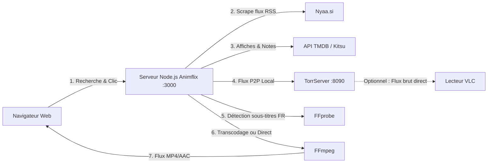

# 🍿 Animflix (ServeurAnimeTorr)

Application web de streaming d'animes en direct à partir de torrents (Nyaa), avec jaquettes automatiques (TMDB), détection intelligente des sous-titres français (FFprobe) et transcodage à la volée (FFmpeg).

---

## 📋 Sommaire
1. [Fonctionnalités](#-fonctionnalités)
2. [Comment ça marche ?](#-comment-ça-marche-)
3. [Prérequis](#-prérequis)
4. [Installation & Configuration](#-installation--configuration)
5. [Lancement de l'application](#-lancement-de-lapplication)
6. [Guide d'utilisation](#-guide-dutilisation)
7. [Dépannage & Astuces](#-dépannage--astuces)

---

## ✨ Fonctionnalités & Optimisations

- **Recherche intégrée sur Nyaa.si** avec filtres : VOSTFR, VF, Multi-Sub, VOSTA.
- **Récupération intelligente des jaquettes et notes** :
  - Compatible **TMDB** avec fallback automatique vers **Kitsu API** (spécialisée anime, 100% gratuite, sans clé requise).
  - Algorithme de nettoyage des titres d'animes pour un matching à 95%+.
- **Système de cache mémoire haute performance** :
  - Cache des métadonnées (affiches & notes) conservé 24h.
  - Cache des recherches (5 min) : résultats quasi-instantanés (< 20 ms).
  - Déduplication des requêtes par lot (1 seule requête API pour 20 épisodes d'une même série).
- **Deux modes de lecture au choix** :
  - ⚡ **Lecture Directe (0% CPU, ultra-rapide)** : copie brute du flux vidéo avec extraction des pistes sous-titres WebVTT en direct dans le navigateur.
  - 🎨 **Incrustation des sous-titres FR (Transcodage)** : FFprobe analyse les flux en 1-2s (`-probesize 4M`), FFmpeg transcode en multithread (`-threads 0`, zéro latence) et incruste les sous-titres français.
- **Personnalisation complète du style des sous-titres** :
  - Menu dédié accessible via le bouton `🎨 Style` ou la touche <kbd>S</kbd>.
  - Réglage de la **taille** (Petite, Normale, Grande, Très grande), de la **couleur** (Blanc, Jaune Anime VOSTFR, Cyan, Vert, Rose), de l'**arrière-plan** (transparent, semi-transparent, opaque), des **contours / ombres** (outline 360°, ombre marquée, etc.) et de la **police**.
  - Aperçu en direct et mémorisation automatique de vos préférences dans le navigateur (`localStorage`).
- **Option de lecture externe (VLC)** : bouton de copie d'URL réseau universelle (détecte dynamiquement l'hôte).
- **Lecteur web enrichi** : raccourcis clavier (<kbd>Espace</kbd> Pause, <kbd>C</kbd> Sous-titres, <kbd>S</kbd> Style, <kbd>F</kbd> Plein écran, <kbd>Échap</kbd> Quitter, <kbd>←</kbd> / <kbd>→</kbd> -5s / +5s).
- **Cache TorrServer augmenté à 200 Mo** pour supprimer les interruptions de flux sur les animes 1080p à haut débit.

---

## ⚙️ Comment ça marche ?



---

## 📦 Prérequis

- **Node.js** (v18 ou supérieure) et **npm**.
- **FFmpeg & FFprobe** :
  ```bash
  sudo apt update
  sudo apt install ffmpeg
  ```

---

## 🔧 Installation & Configuration

### 1. Installer les dépendances Node.js

Dans le répertoire du projet :
```bash
npm install
```

### 2. Droits d'exécution de TorrServer

```bash
chmod +x TorrServer-linux-amd64
```

---

## 🚀 Lancement de l'application

### Option A : Gestion recommandée avec PM2 (déjà configuré)

L'application est configurée pour tourner en arrière-plan avec PM2 :

```bash
# Vérifier l'état des services
pm2 list

# Redémarrer l'application
pm2 restart animflix

# Voir les logs en direct
pm2 logs animflix
```

### Option B : Lancement manuel (2 terminaux)

Dans le premier terminal (TorrServer) :
```bash
./TorrServer-linux-amd64
```

Dans le second terminal (Animflix) :
```bash
npm start
# ou : node animflix.js
```

---

## 🖥️ Guide d'utilisation

1. Ouvrez votre navigateur sur :
   - En local : [http://localhost:3000](http://localhost:3000)
   - Sur votre réseau local : `http://<IP_SERVEUR>:3000` (ex: `192.168.1.55:3000`).
2. Entrez le nom d'un anime dans la barre de recherche.
3. Choisissez la langue : **VOSTFR**, **VF**, **Multi-Sub** ou **VOSTA**.
4. Sélectionnez votre mode de streaming :
   - **⚡ Lecture Directe** : 0% CPU, démarrage instantané avec sous-titres intégrés dans le site.
   - **🔄 Transcodage H.264** : compatibilité standard si votre navigateur ne supporte pas le format d'origine.
5. Cliquez sur un épisode pour lancer la lecture :
   - **Sous-titres automatiques** : Les sous-titres français (VOSTFR) sont automatiquement extraits et affichés directement dans le lecteur web avec un rendu haute lisibilité.
   - **Sélecteur de pistes & bouton CC** : Vous pouvez changer de piste de sous-titres ou les masquer en un clic.
6. **Raccourcis clavier dans le lecteur** :
   - `Espace` : Lecture / Pause
   - `C` : Activer / Masquer les sous-titres
   - `F` : Basculer en plein écran
   - `Échap` : Fermer le lecteur
   - `←` / `→` : Reculer / Avancer de 5 secondes
7. **Lecture VLC (Alternative)** :
   - Si vous préférez utiliser votre lecteur externe dédié (pour bénéficier des styles graphiques ASS avancés ou des polices exotiques), cliquez sur **🟠 Ouvrir dans VLC** (le lien est copié dans votre presse-papiers).
   - Dans VLC : `Média > Ouvrir un flux réseau (Ctrl+N)` et collez l'URL.

---

## ❓ Dépannage & Astuces

- **Le processeur chauffe ou la vidéo saccade ?**
  - Basculez le sélecteur sur **⚡ Lecture Directe** ou utilisez le lien **VLC**.
- **Pas de résultat / recherche lente ?**
  - Vérifiez la connexion Internet et les filtres Nyaa. Le cache garde vos recherches précédentes en mémoire pour un accès immédiat.
- **Accès depuis une TV / Smartphone** :
  - Connectez l'appareil au même réseau Wi-Fi que le serveur et ouvrez l'adresse IP locale du serveur sur le port 3000.