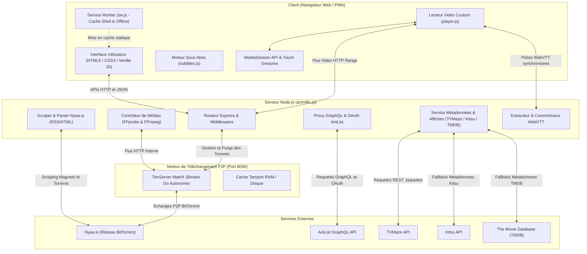
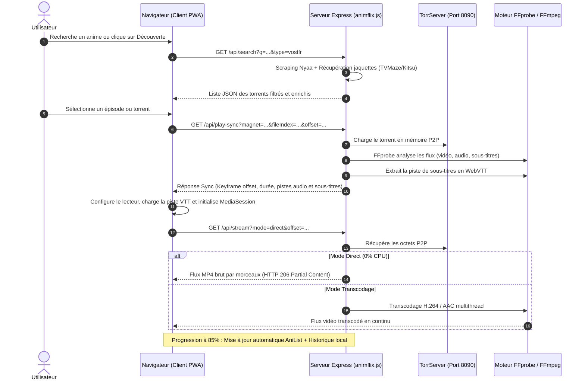

# 🍿 Animflix (ServeurAnimeTorr)

[](https://nodejs.org/)
[](https://web.dev/progressive-web-apps/)
[](https://github.com/YouROK/TorrServer)
[](https://ffmpeg.org/)
[](https://anilist.co/)

Application web complète et moderne de streaming d'animes en direct à partir de torrents (Nyaa.si), sans attente de téléchargement complet. Intègre un lecteur multimédia sur-mesure optimisé pour desktop et mobile (PWA), la synchronisation en temps réel avec AniList, l'extraction de sous-titres WebVTT à la volée (0% CPU), la détection intelligente des pistes audio/sous-titres français (FFprobe), et le transcodage matériel/logiciel (FFmpeg).

---

## 📋 Sommaire
1. [Fonctionnalités Clés](#-fonctionnalités-clés)
2. [Architecture Technique de l'Application](#-architecture-technique-de-lapplication)
   - [Diagramme d'Architecture Globale](#diagramme-darchitecture-globale)
   - [Flux de Données & Streaming](#flux-de-données--streaming)
   - [Organisation Modulaire des Fichiers](#organisation-modulaire-des-fichiers)
3. [Prérequis Système](#-prérequis-système)
4. [Installation & Configuration](#-installation--configuration)
5. [Déploiement & Lancement](#-déploiement--lancement)
   - [Option A : PM2 (Recommandé en Production)](#option-a--pm2-recommandé-en-production)
   - [Option B : Docker & Docker-Compose](#option-b--docker--docker-compose)
   - [Option C : Lancement Manuel (Développement)](#option-c--lancement-manuel-développement)
6. [Guide d'Utilisation](#-guide-dutilisation)
7. [Contrôles, Gestes & Raccourcis](#-contrôles-gestes--raccourcis)
   - [📱 Gestes Tactiles Mobile & Tablette](#-gestes-tactiles-mobile--tablette)
   - [⌨️ Raccourcis Clavier Desktop](#️-raccourcis-clavier-desktop)
8. [Dépannage & FAQ](#-dépannage--faq)

---

## ✨ Fonctionnalités Clés

### 🍿 1. Découverte & Accueil à Froid (Cold Start)
- **Onglet Découverte Automatique** : Les nouveaux visiteurs sans historique ou non connectés arrivent directement sur une sélection riche d'animes au lieu d'un écran vide.
- **Double Sélection AniList en Temps Réel** :
  - **🔥 Tendances du Moment** : Les 12 séries les plus populaires et discutées cette semaine.
  - **🌸 Saison en Cours** : Calculée dynamiquement selon la date (Automne, Hiver, Printemps, Été + Année) avec les sorties incontournables.
- **Cartes Interactives & Détaillées** : Note moyenne, format (TV, Movie, OVA), genres, compte à rebours de diffusion en direct (`⏳ Ép. X dans 2j 5h`). Un clic lance instantanément la recherche de torrents.
- **Cache Local Haute Performance** : Données mises en cache 30 minutes dans `localStorage` pour un affichage instantané (0 ms de latence) lors des changements d'onglets.

### 🔍 2. Recherche & Filtrage Multi-Critères
- **Scraping Nyaa.si ultra-rapide (< 400 ms)** avec extraction d'infoHash et génération directe de magnets P2P (contourne les protections Cloudflare).
- **Barre d'outils dynamique** avec compteur de résultats.
- **Filtres rapides (Chips)** : `Tous`, `1080p Full HD`, `720p HD`, `📦 Packs / Saisons`.
- **Tri intelligent** : `🌱 Seeders (Les plus rapides)`, `⚡ Pertinence` (avec priorité à l'épisode ciblé), `📦 Taille (Plus grand)`, `📦 Taille (Plus léger)`.
- **Inspection des Packs & Saisons (Batches)** : Détection automatique des fichiers vidéo au sein d'un pack torrent avec menu interactif de sélection d'épisodes.

### 🎬 3. Lecteur Multimédia Sur-Mesure & Sous-Titres WebVTT
- **Deux Modes de Lecture** :
  - ⚡ **Lecture Directe (0% CPU, ultra-rapide)** : Copie brute du flux vidéo MP4 vers le navigateur avec extraction et streaming des pistes de sous-titres WebVTT.
  - 🔄 **Transcodage H.264 Universel** : Encodage multithread FFmpeg à la volée en cas de codec audio/vidéo non supporté nativement.
- **Timeline Scrubber Fluide** : Prévisualisation temporelle (tooltip), indicateur de tampon réseau (buffer), scrubbing interactif à la souris et au toucher.
- **Contrôles Avancés** :
  - Saut d'opening en 1 clic (**Skip OP +85s**).
  - Sauts temporels rapides (`-10s` / `+10s`).
  - Sélecteur de vitesse de lecture (`0.75x`, `1x`, `1.25x`, `1.5x`, `2x`).
  - **Boost Vocal & Égalisation (Web Audio API)** : Compresseur dynamique pour rendre les voix intelligibles sans subir d'explosions sonores assourdissantes.
- **Moteur de Sous-Titres Sur-Mesure** :
  - Synchronisation temporelle calée au **Keyframe réel** (`/api/play-sync`).
  - Fusion intelligente des coupures artificielles sur une seule ligne tout en préservant les répliques de dialogue (`- `) et les paroles de chansons (`♪`).
  - Personnalisation intégrale : taille, couleurs (Blanc, Jaune VOSTFR, Cyan, Vert, Rose), fond, contours 360°, ombrages et polices.
  - Ajustement manuel à la volée de la synchronisation des sous-titres (<kbd>G</kbd>/<kbd>H</kbd>) et de l'audio (<kbd>J</kbd>/<kbd>K</kbd>).

### 📱 4. Expérience Mobile & PWA (Progressive Web App)
- **Installable en 1 clic** sur Android, iOS, Windows et macOS (manifeste complet, icônes maskable).
- **Raccourcis d'Application (App Shortcuts)** : Accès direct depuis l'écran d'accueil à la Recherche, à l'Historique ou aux Favoris.
- **Verrouillage d'Orientation Paysage** : En plein écran sur mobile, bascule et verrouille automatiquement la vidéo en mode paysage.
- **Intégration Native MediaSession API** : Métadonnées, affiche HD et contrôles multimédias sur l'écran de verrouillage du smartphone et les casques/écouteurs Bluetooth.
- **Gestes Tactiles Naturels** : Double-tap gauche (-10s), double-tap droite (+10s), double-tap centre (Pause / Play), tap simple pour afficher/masquer les commandes avec temporisation intelligente (4,5s).

### ☁️ 5. Suivi AniList, Historique & Favoris
- **Synchronisation AniList Bi-directionnelle** : Connexion OAuth sécurisée, synchronisation automatique de l'épisode visionné à 85% ou à la fin, affichage des animés en cours.
- **Historique Local & Reprise** : Mémorisation exacte de la position de lecture à la seconde près dans `localStorage`, avec bannière de reprise automatique.
- **Favoris Locaux Hors Ligne** : Sauvegarde d'animes favoris accessible sans compte tiers.

### ⚡ 6. Feedback P2P & TorrServer en Direct
- **Télémétrie en temps réel (`/api/torrserver/stats`)** :
  - Débit descendant et montant instantané (Mo/s, Ko/s).
  - Nombre de pairs actifs connectés et swarm total détecté.
  - Nombre de seeders sources disponibles.
  - Progression en pourcentage et volume du tampon de préchargement (preload buffer).
- **Écran de chargement interactif (`#player-status`)** :
  - Remplacement du simple spinner figé par des puces dynamiques en direct (Débit ⚡, Pairs 🌱, Tampon 📦 avec jauge de progression animée).
  - Messages d'état évolutifs selon la phase réelle de TorrServer (*Recherche métadonnées & pairs*, *Mise en mémoire tampon*, *Démarrage du flux*).
  - Détection proactive des torrents sans seeders avec alerte visuelle et invitation à basculer sur un autre flux ou VLC.
- **Badge HUD Flottant interactif dans le lecteur** :
  - Puce discrète avec témoin LED dynamique (Vert clignotant en streaming rapide, Jaune en buffer, Gris en veille).
  - Carte HUD popup tactile/cliquable affichant l'ensemble des métriques BitTorrent sans interrompre le visionnage.
  - Gestion optimisée des ressources : polling accéléré (1s) lors des transitions et rebuffering, allégé (2,5s) en lecture fluide, et coupure immédiate dès la fermeture du lecteur.

---

## 🏛️ Architecture Technique de l'Application

### Diagramme d'Architecture Globale


```mermaid
flowchart TB
    subgraph Client ["Client (Navigateur Web / PWA)"]
        UI["Interface Utilisateur (HTML5 / CSS3 / Vanilla JS)"]
        SW["Service Worker (sw.js - Cache Shell & Offline)"]
        Player["Lecteur Vidéo Custom (player.js)"]
        SubEngine["Moteur Sous-titres (subtitles.js)"]
        MediaSession["MediaSession API & Touch Gestures"]
    end

    subgraph Backend ["Serveur Node.js (animflix.js)"]
        Router["Routeur Express & Middlewares"]
        NyaaScraper["Scraper & Parser Nyaa.si (RSS/HTML)"]
        MetaService["Service Métadonnées & Affiches (TVMaze / Kitsu / TMDB)"]
        AnilistProxy["Proxy GraphQL & OAuth AniList"]
        MediaProcessor["Contrôleur de Médias (FFprobe & FFmpeg)"]
        SubExtractor["Extracteur & Convertisseur WebVTT"]
    end

    subgraph P2PEngine ["Moteur de Téléchargement P2P (Port 8090)"]
        TorrServer["TorrServer MatriX (Binaire Go Autonome)"]
        RAMCache["Cache Tampon RAM / Disque"]
    end

    subgraph External ["Services Externes"]
        Nyaa["Nyaa.si (Réseau BitTorrent)"]
        AniListAPI["AniList GraphQL API"]
        TVMaze["TVMaze API"]
        Kitsu["Kitsu API"]
        TMDB["The Movie Database (TMDB)"]
    end

    %% Interactions Client <-> Backend
    UI <-->|APIs HTTP et JSON| Router
    SW -.->|Mise en cache statique| UI
    Player <-->|Flux Video HTTP Range| Router
    Player <-->|Pistes WebVTT synchronisees| SubExtractor
    Player <--> MediaSession

    %% Interactions Backend <-> Moteur P2P
    MediaProcessor <-->|Flux HTTP Interne| TorrServer
    Router <-->|Gestion et Purge des Torrents| TorrServer

    %% Interactions Backend <-> Externes
    NyaaScraper <-->|Scraping Magnets et Torrents| Nyaa
    AnilistProxy <-->|Requetes GraphQL et OAuth| AniListAPI
    MetaService <-->|Requetes REST Jaquettes| TVMaze
    MetaService <-->|Fallback Metadonnees Kitsu| Kitsu
    MetaService <-->|Fallback Metadonnees TMDB| TMDB

    %% TorrServer P2P Swarm
    TorrServer <-->|Echanges P2P BitTorrent| Nyaa
```

---

### Flux de Données & Streaming


```mermaid
sequenceDiagram
    autonumber
    actor User as Utilisateur
    participant Browser as Navigateur (Client PWA)
    participant Server as Serveur Express (animflix.js)
    participant Torr as TorrServer (Port 8090)
    participant FFmpeg as Moteur FFprobe / FFmpeg

    User->>Browser: Recherche un anime ou clique sur Découverte
    Browser->>Server: GET /api/search?q=...&type=vostfr
    Server->>Server: Scraping Nyaa + Récupération jaquettes (TVMaze/Kitsu)
    Server-->>Browser: Liste JSON des torrents filtrés et enrichis

    User->>Browser: Sélectionne un épisode ou torrent
    Browser->>Server: GET /api/play-sync?magnet=...&fileIndex=...&offset=...
    Server->>Torr: Charge le torrent en mémoire P2P
    Server->>FFmpeg: FFprobe analyse les flux (vidéo, audio, sous-titres)
    Server->>FFmpeg: Extrait la piste de sous-titres en WebVTT
    Server-->>Browser: Réponse Sync (Keyframe offset, durée, pistes audio et sous-titres)

    Browser->>Browser: Configure le lecteur, charge la piste VTT et initialise MediaSession
    Browser->>Server: GET /api/stream?mode=direct&offset=...
    Server->>Torr: Récupère les octets P2P
    alt Mode Direct (0% CPU)
        Server-->>Browser: Flux MP4 brut par morceaux (HTTP 206 Partial Content)
    else Mode Transcodage
        Server->>FFmpeg: Transcodage H.264 / AAC multithread
        FFmpeg-->>Browser: Flux vidéo transcodé en continu
    end

    Note over Browser,Server: Progression à 85% : Mise à jour automatique AniList + Historique local
```

---

### Organisation Modulaire des Fichiers

```
ServeurAnimeTorr/
├── animflix.js               # Serveur Express, APIs REST, streaming, proxy AniList, FFmpeg
├── TorrServer-linux-amd64    # Binaire serveur BitTorrent autonome (TorrServer MatriX)
├── ecosystem.config.cjs      # Fichier d'orchestration pour le gestionnaire PM2
├── Dockerfile                # Image de conteneurisation optimisée (Node.js + FFmpeg + TorrServer)
├── docker-compose.yml        # Déploiement multi-services Docker Compose
├── package.json              # Dépendances Node.js (express, axios, xml2js, cors, etc.)
│
├── public/                   # Frontend SPA & PWA (servi par Express)
│   ├── index.html            # Structure HTML5 (Catalogue, Lecteur, Modales, Bannières)
│   ├── manifest.json         # Manifeste PWA (icônes, orientation, raccourcis d'application)
│   ├── sw.js                 # Service Worker (stratégie de cache pour mode hors-ligne)
│   │
│   ├── css/
│   │   ├── style.css         # Thème global, grille, bannières, filtres & modales
│   │   ├── player.css        # Lecteur vidéo personnalisé, scrubber timeline, styles VTT
│   │   └── anilist.css       # Widgets AniList, onglet Découverte, badges de statut
│   │
│   ├── js/
│   │   ├── app.js            # Initialisation, routage simple, PWA install prompt, modales
│   │   ├── search.js         # Recherche Nyaa, filtrage & tri, analyse des packs d'épisodes
│   │   ├── player.js         # Lecteur vidéo, MediaSession, gestes tactiles, boost vocal
│   │   ├── subtitles.js      # Décodage WebVTT, recalage au keyframe, moteur de styles
│   │   ├── history.js        # Historique local, reprise de lecture, onglets, favoris
│   │   └── anilist.js        # OAuth AniList, onglet Découverte (Tendances/Saison), GraphQL
│   │
│   └── icons/                # Icônes de l'application PWA (SVG, PNG standard & maskable)
│
└── cache/                    # Répertoire temporaire (sous-titres extraits .vtt, logs TorrServer)
```

---

## 📦 Prérequis Système

- **Système d'exploitation** : Linux (Ubuntu, Debian, Arch, CentOS), macOS ou Windows (via WSL2).
- **Node.js** : Version 18.0.0 ou supérieure.
- **FFmpeg & FFprobe** : Indispensables pour l'analyse des flux et l'extraction de sous-titres.
  ```bash
  # Debian / Ubuntu / Raspberry Pi OS
  sudo apt update && sudo apt install -y ffmpeg

  # Arch Linux
  sudo pacman -S ffmpeg

  # macOS (Homebrew)
  brew install ffmpeg
  ```

---

## 🔧 Installation & Configuration

### 1. Cloner et installer les dépendances

```bash
git clone https://github.com/votre-compte/ServeurAnimeTorr.git
cd ServeurAnimeTorr
npm install
```

### 2. Rendre le binaire TorrServer exécutable

```bash
chmod +x TorrServer-linux-amd64
```

### 3. (Optionnel) Configuration AniList OAuth

Pour activer l'authentification officielle AniList :
1. Créez une application sur [AniList Developer Settings](https://anilist.co/settings/developer).
2. Définissez le Redirect URI sur votre URL d'accès (ex: `http://localhost:3000` ou `http://192.168.1.50:3000`).
3. Renseignez votre `Client ID` directement dans l'interface de l'application via le bouton **Paramètres ⚙️**.

---

## 🚀 Déploiement & Lancement

### Option A : PM2 (Recommandé en Production)

PM2 garantit une exécution continue en tâche de fond avec redémarrage automatique en cas d'erreur ou au redémarrage de la machine.

```bash
# 1. Installer PM2 globalement
sudo npm install -g pm2

# 2. Démarrer les services avec le fichier ecosystem fourni
pm2 start ecosystem.config.cjs

# 3. Sauvegarder pour le démarrage automatique au boot
pm2 save
pm2 startup
```

**Commandes utiles au quotidien :**
```bash
pm2 status               # Afficher l'état d'Animflix et TorrServer
pm2 logs animflix        # Consulter les logs en temps réel
pm2 restart animflix     # Redémarrer l'application
pm2 restart all          # Redémarrer tous les services
pm2 stop all             # Arrêter les services
```

---

### Option B : Docker & Docker-Compose

Un environnement conteneurisé prêt à l'emploi est disponible :

```bash
# Démarrer en arrière-plan
docker compose up -d

# Voir les logs
docker compose logs -f

# Arrêter
docker compose down
```

---

### Option C : Lancement Manuel (Développement)

Dans deux terminaux distincts :

```bash
# Terminal 1 : Lancement du moteur P2P TorrServer
./TorrServer-linux-amd64

# Terminal 2 : Lancement du serveur d'application Animflix
npm start
```

---

## 🖥️ Guide d'Utilisation

1. **Accès à l'application** :
   - Depuis le serveur : [http://localhost:3000](http://localhost:3000)
   - Depuis un autre appareil sur le même réseau local (smartphone, tablette, TV) : `http://<IP_DU_SERVEUR>:3000` (ex: `http://192.168.1.45:3000`).
2. **Page d'Accueil & Découverte** :
   - Explorez les tendances et la saison en cours dès l'ouverture.
   - Si vous connectez votre compte AniList, l'onglet **🍿 AniList En cours** se synchronise instantanément.
3. **Recherche & Filtres** :
   - Saisissez le nom d'un anime.
   - Filtrez par langue (VOSTFR, VF, Multi-Sub, VOSTA) et affinez avec les chips de résolution (`1080p`, `720p`, `Packs`).
4. **Lecture & Gestion d'Épisodes** :
   - Choisissez le mode de lecture (Direct ou Transcodage).
   - Pour les packs complets, sélectionnez l'épisode souhaité dans la liste.
5. **Personnalisation & Confort** :
   - Personnalisez le rendu visuel des sous-titres via le bouton **`🎨 Style`**.
   - Activez le **Boost Vocal** si les voix sont masquées par les effets sonores.
   - Utilisez **`🧹 Nettoyer le cache`** pour libérer la mémoire vive du moteur P2P si besoin.

---

## 🎮 Contrôles, Gestes & Raccourcis

### 📱 Gestes Tactiles Mobile & Tablette

| Geste sur l'écran | Action | Zone d'Effet |
| :--- | :--- | :--- |
| **Tap Simple** | 👁️ Afficher ou masquer les contrôles (auto-masquage après 4,5s) | Tout l'écran |
| **Double-Tap Gauche** | ⏪ Reculer de **-10s** (cumulatif : -20s, -30s...) | Tiers gauche (< 35% largeur) |
| **Double-Tap Milieu** | ⏯️ **Mettre en Pause / Relancer la vidéo** (avec feedback visuel) | Zone centrale (35% à 65%) |
| **Double-Tap Droite** | ⏩ Avancer de **+10s** (cumulatif : +20s, +30s...) | Tiers droit (> 65% largeur) |
| **Plein Écran Mobile** | 🔄 Verrouillage automatique en mode **Paysage** | Bouton ⛶ ou bascule native |

---

### ⌨️ Raccourcis Clavier Desktop

| Touche | Action |
| :---: | :--- |
| <kbd>Espace</kbd> | Lecture / Pause |
| <kbd>←</kbd> / <kbd>→</kbd> | Reculer / Avancer de **10 secondes** |
| <kbd>↑</kbd> / <kbd>↓</kbd> | Augmenter / Diminuer le volume sonore (+5% / -5%) |
| <kbd>M</kbd> | Couper / Réactiver le son (Mute) |
| <kbd>C</kbd> | Activer / Désactiver les sous-titres (CC ON / OFF) |
| <kbd>S</kbd> | Ouvrir / Fermer le menu de style et synchronisation des sous-titres |
| <kbd>G</kbd> / <kbd>H</kbd> | Ajuster la **synchronisation des sous-titres** (-0.1s / +0.1s) |
| <kbd>J</kbd> / <kbd>K</kbd> | Ajuster la **synchronisation de la piste audio** (-0.1s / +0.1s) |
| <kbd>F</kbd> | Basculer en mode Plein écran |
| <kbd>Échap</kbd> | Quitter le plein écran, fermer les modales ou revenir au catalogue |

---

## ❓ Dépannage & FAQ

<details>
<summary><b>1. Les sous-titres ou le son ont un léger décalage ?</b></summary>
Certains encodages de torrents possèdent un délai audio/texte intrinsèque. Utilisez simplement les touches <kbd>G</kbd> / <kbd>H</kbd> pour caler les sous-titres et <kbd>J</kbd> / <kbd>K</kbd> pour l'audio au dixième de seconde près. Le réglage est conservé durant tout le visionnage.
</details>

<details>
<summary><b>2. La vidéo saccade ou le processeur monte à 100% ?</b></summary>
Passez le mode de lecture en <b>⚡ Lecture Directe</b>. Ce mode effectue une copie brute du flux vidéo sans solliciter le processeur (0% CPU). Si votre matériel ne supporte pas le codec de base, vous pouvez également cliquer sur <b>🟠 Ouvrir dans VLC</b> pour déléguer le décodage au lecteur VLC externe.
</details>

<details>
<summary><b>3. TorrServer sature la mémoire RAM ?</b></summary>
Cliquez sur le bouton <b>`🧹`</b> dans la barre de navigation pour vider le cache en mémoire vive. De plus, Animflix purge automatiquement le torrent de la mémoire dès que vous fermez la fiche de lecture.
</details>

<details>
<summary><b>4. Comment installer l'application sur smartphone (PWA) ?</b></summary>
Ouvrez l'adresse de votre serveur sur Chrome (Android) ou Safari (iOS). Cliquez sur <b>"Installer l'application"</b> (ou <i>Partager > Sur l'écran d'accueil</i> sur iOS). Animflix s'ouvrira alors en plein écran comme une application native sans barre d'adresse.
</details>

---

<p align="center">
  Développé pour les passionnés d'anime 🍿
</p>